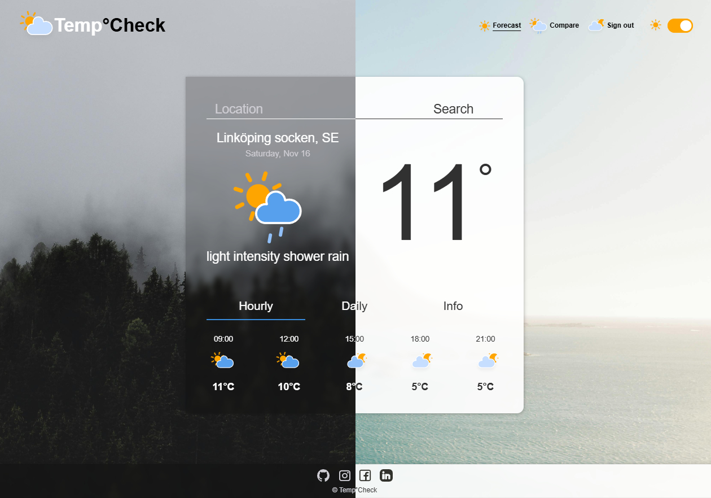

# 
  Temp°Check &nbsp;  

A simple weather app that shows real-time weather data for any location.  
Created as a **group project**.

* Dark/light theme
* Responsive design
* Powered by Openweather API

### Preview

   

